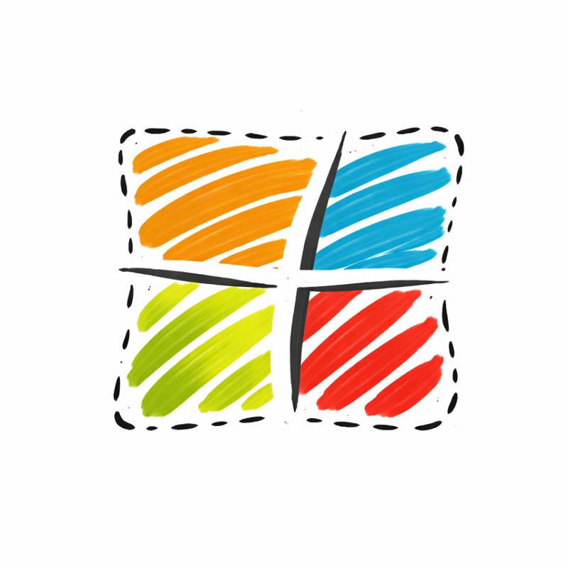

<div align="center">



# LocalTab

**A lightweight localhost dashboard for developers.**
View and manage multiple local dev servers in one browser tab.

[](LICENSE)

</div>

---

## Features

- **Multiple Layouts** - Row, Column, 2x2 Grid, Left/Right/Top Main, Tab Mode
- **Tab Mode** - Browser-like tabs for switching between panels
- **Panel Management** - Add, remove, rename panels on the fly
- **Keyboard Shortcuts** - Fast navigation without touching the mouse
- **Auto-Save** - Configuration persists in localStorage
- **Import/Export** - Share or backup your setup as JSON
- **Notification Badges** - See which panels have updates
- **Port Scanner** - Backend API to auto-detect running dev servers

## Quick Start

1. Open `index.html` in your browser
2. Add your localhost URLs
3. Pick a layout that works for you

### Backend (Optional)

The backend provides automatic port scanning to discover running dev servers.

```bash
cd server
bun install
bun run index.ts
```

Then open `admin.html` to scan and manage ports.

## Keyboard Shortcuts

| Key | Action |
|-----|--------|
| `1-9` | Focus panel by number |
| `R` | Reload current panel(s) |
| `←` `→` | Switch tabs (Tab Mode) |

## Configuration

| Action | Description |
|--------|-------------|
| **Export** | Download current setup as JSON |
| **Import** | Load a saved configuration |
| **Reset** | Restore default settings |

## Tech Stack

| Component | Technology |
|-----------|------------|
| Frontend | Single HTML file, vanilla JS, no dependencies |
| Backend | Bun + Elysia (TypeScript) |
| Storage | localStorage (browser) |

## License

MIT
